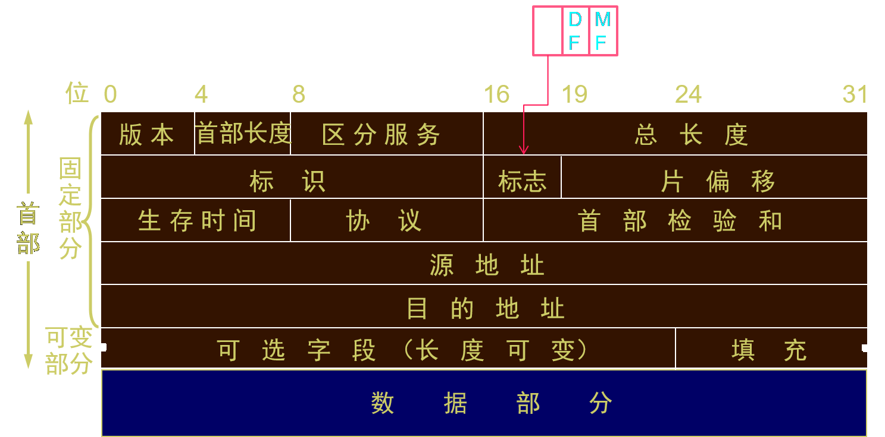

# 第一章 概论

性能指标

$1kb=10^3b$

$1Mb=10^6b$

$1Gb=10^9b$

$1Tb=10^{12}b$

$K=2^{20}=1024M=2^{20},$

$G=2^{30}$

$T=2^{40}$

* 速率（b/s, Mb/s）

* 带宽（bit/s, b/s）

* 吞吐量（bit）

* $发送时延=\frac{数据块长度(bit)}{发送速率(bit/s)}$

* $传播时延=\frac{信道长度(m)}{信道传播速率(m/s)}$

$$
五层协议\begin{cases}应用层\\运输层\\网络层\\数据链路层\\物理层
\end{cases}\\ \ \\
分类\begin{cases}分布范围\begin{cases}广域网WAN\\域域网MAN\\局域网LAN\\个域网PAN
\end{cases}\\使用者\begin{cases}公用网\\专用网\end{cases}\\拓扑结构\begin{cases}
总线型\\星型\\环型\\网状型\end{cases}\\数据交换技术\begin{cases}电路交换\\报文交换\\分组交换
\end{cases}
\end{cases}
$$

两个对等实体间的通信使得本层能*向上一层提供服务*，要实现本层协议，还需要使用*下层*所提供的服务

# 第二章 物理层 (bit)

集线器、中继器

$N进制数字信号：1个码元携带log_2N比特信息$

$信道带宽W(Hz)\\码元种数V\\信噪比(dB)=10log_{10}(S/N)$

$奈氏准则：理想低通信道下的极限数据传输率=2Wlog_2V$

$香农定理：信道的极限信息传输速率C=Wlog_2(1+\frac{S}{N})b/s$

$$
信道复用技术\begin{cases}频分复用(FDM)\\时分复用(TDM)\\统计时分复用(STDM)\\波分复用(WDM)
\\码分复用(CDM)\end{cases}\\ \ \\
4种特性\begin{cases}
机械特性\\电气特性\\功能特性\\规程特性
\end{cases}
$$

抗干扰能力&带宽：光纤>同轴电缆>双绞线

# 第三章 数据链路层 (帧)

交换机、网桥

为相邻结点提供可靠数据传输

CSMA/CD: 广播型信道中的一个防冲突的技术： 先听后发、边听边发、冲突检测、延迟后发

$$
类型\begin{cases}点对点信道\\广播信道
\end{cases}
$$

$$
解决的基本问题\begin{cases}封装成帧\\透明传输\begin{cases}字符填充\\零比特填充\end{cases}\\差错检测
\end{cases}
$$

$$
VLAN虚拟局域网\begin{cases}定义：将一个物理的局域网划分为多个虚拟的局域网\\优点\begin{cases}
划分广播域\\增强局域网的安全性\\提高健壮性\\灵活构建工作组
\end{cases}\\划分方式：端口Access、Trunk
\end{cases}
$$

字符填充：0x7E --> 0x7D, 0x5E

                   0x7D--> 0x7D, 0x5D

零比特填充：5个连续1，填入0

最大传送单元(MTU)是帧的数据部分

$$
差错检测\begin{cases}循环冗余检验CRC ****\\帧检验序列FCS
\end{cases}
$$

以太网提供的服务是 *尽最大努力的交付*

碰撞检测$争用期=51.2s，可发送512bit，即64字节。\quad小于64字节的帧为无效帧$

$$
以太网参数\alpha=\frac{\tau}{T_0}=\frac{\tau}{L/C}=\frac{\tau C}{L}\\
\alpha \rightarrow 0, 一发生碰撞就立即可以检测出来，立即停止发送，信道利用率很高\\\alpha\uparrow争用期所占比例增大，信道利用率减低\\
极限信道利用率S_{max}=\frac{T_0}{T_0+\tau}=\frac{1}{1+\alpha}
$$

    在数据链路层扩展局域网是使用$网桥$

10Gbit只工作在全双工方式

VLAN Trunk：让连接在不同交换机上的相同VLAN的主机互通 

# 第四章 网络层 (IP数据报、分组)

路由器

网络层向上只提供无连接、尽最大努力交付的数据报服务

$$
中间设备\begin{cases}物理层：转发器\\数据链路层：网桥或交换机\\网络层：路由器\\网络层以上：网关
\end{cases}
$$

| 分类  | 网络号  | 号         | IP      | 子网掩码          |
|:---:|:----:|:---------:|:-------:|:-------------:|
| A类  | 前8位  | 0xxx xxxx | 0-126   | 255.0.0.0     |
| B类  | 前16位 | 10xx xxxx | 128-191 | 255.255.0.0   |
| C类  | 前24位 | 110x xxxx | 192-223 | 255.255.255.0 |
| D类  | 多播地址 | 1110 xxxx | 224-239 |               |

$IP地址\Rightarrow ARP \Rightarrow 物理地址 \Rightarrow RARP \Rightarrow IP地址\\ARP请求是采用广播方式发送的$

$$
发送方\begin{cases}
主机\begin{cases}本网络上另一个主机\Rightarrow ARP找到目的主机的硬件地址\\另一个网络上的主机\Rightarrow ARP找到本网络上的路由器硬件地址
\end{cases}\\路由器\begin{cases}本网络上另一个主机\Rightarrow ARP找到目的主机硬件地址\\另一个网络上的主机\Rightarrow ARP找到本网络上的路由器硬件地址
\end{cases}
\end{cases}
$$

标志字段中MF=1表示后面还有分片，MF=0表示最后一个分片

                    DF=0才允许分片

片偏移以8字节为偏移单位888

生存时间TTL（数据报在网络中可通过的路由器数的最大值）

首部检验和只检验数据报的首部，不检验数据部分

从一个IP数据报的首部无法判断源主机所连接的网络是否进行了子网划分

$$
IP地址\ \& \ 子网掩码=网络地址\\\ \\
CIDR：\  128.14.32.0/20(前20位一致)\\
从1000\ 0000\ .\ 0000\ 1110\ .\ 0010\ 0000\ .\ 0000\ 0000\\
到1000\ 0000\ .\ 0000\ 1110\ .\ 0010\ 1111\ .\ 1111\ 1111
$$

$$
两大类路由选择协议\begin{cases}内部网关协议IGP\\外部网关协议EGP
\end{cases}
$$

$$
内部网关协议\begin{cases}RIP\begin{cases}基于距离向量算法\\
距离\geq16为不可达\\仅和相邻路由器交换自己的路由表\\按固定时间间隔交换路由信息
\end{cases}\\\ \\OSPF\begin{cases}基于最短路径优先算法\\是分布式的链路状态协议\\
向本自治系统中所有路由器发送相邻路由器的链路状态\\
当链路状态发生变化时才采用洪泛法发送信息
\end{cases} \end{cases}
$$

$$
外部网关协议BGP\begin{cases}管理员选择"BGP发言人"\\四种报文\begin{cases}打开\\更新\\保活\\通知
\end{cases}\\
\end{cases}
$$

$$
IPV6目的地址\begin{cases}单播(unicast)\\多播(multicast)\\任播(anycast)
\end{cases}
$$

$$
多播协议\begin{cases}主机-路由器之间(IGMP)\\路由器-路由器之间\end{cases}\\
IGMP：新的主机加入组，发送报告;主机离开组，发送离开消息
$$

# 第五章 运输层 (报文段)

运输层提供应用进程间的逻辑通信

在计算机中的进程用进程标识符来标志

TCP连接的端点是套接字Socket=(主机IP地址+端口号)或插口

|      | TCP                     | UDP                             |
|:----:|:-----------------------:|:-------------------------------:|
| 数据单位 | TCP报文段                  | UDP用户数据报                        |
| 连接   | 面向连接                    | 不需建立连接                          |
| 通信   | 一对一，不提供广播或多播            | 不需接收方给出任何确认                     |
| 可靠性  | 可靠，增加开销                 | 不可靠，效率高                         |
| 面向   | 字节流                     | 报文                              |
| 协议   | SMTP, TELNET, HTTP, FTP | DNS, TFTP, RIP, DHCP, SNMP, NFS |
| 通信   | 全双工                     |                                 |

$$
信道利用率U=\frac{T_D}{T_D+RRT+T_A}
$$

采用流水线传输，根据连续ARQ协议（滑动窗口），接收方采用累计确认的方式

TCP报文段的首部格式：

确认号字段是期望收到对方的下一个报文段的第一个字节的序号

| 缩写  | 中文  | 意义                           |
|:---:|:---:|:----------------------------:|
| URG | 紧急  | URG=1时表明紧急指针字段有效             |
| ACK | 确认  | ACK=1时确认号字段有效                |
| PSH | 推送  | PSH=1时尽快交付，不再等到缓存填满再向上交付     |
| RST | 复位  | RST=1时表明TCP连接中出现严重差错，需立即释放连接 |
| SYN | 同步  | SYN=1时表示这是一个连接请求或连接接受报文      |
| FIN | 终止  | FIN=1时表明此报文段以发送完毕，请求释放连接     |

Karn算法解决超时重传的问题

$$
\begin{cases}拥塞控制：防止过多的数据注入网络
\\流量控制：抑制发送端发送数据的速率
\end{cases}
$$

$$
拥塞控制四种算法\begin{cases}慢开始：设置初始发送窗口cwnd=1，每收到一个确认cwnd++
\\拥塞避免：设置门限ssthresh,当cwnd>ssthresh时停止慢开始算法，cwnd++\\
快重传：接收方每收到一个失序的报文段就立即发出重复确认，发送方一连收到3个重复确认就重传\\
快恢复：发送端收到3个重复确认，ssthresh\ /=2,\ cwnd=ssthresh，执行拥塞避免算法
\end{cases}\\ \ \\出现拥塞时ssthresh=\frac{cwnd}{2}; \ cwnd=1\\ \ \\
发送窗口的上限值=min(rwnd, cwnd)
$$

主动队列管理是为了避免全局同步现象

$$
TCP运输连接\begin{cases}连接建立\begin{cases}客户\\服务器\\三次握手
\end{cases}\\数据传送\\连接释放
\end{cases}
$$

                                                                        三次握手

                                                                         四次挥手

$$
A必须等待2MSL（最长报文段寿命）\begin{cases}为了保证A发送的最后一个ACK报文段能到达B\\
防止“已失效的连接请求报文段”出现在本连接中
\end{cases}
$$

# 第六章 应用层

当应用进程需要进行通信时，操作系统为其创建套接字，用套接字描述符来表示这些资源

$$
应用层（基于客户服务器）\begin{cases}
域名系统DNS，端口号53\\文件传送协议FTP，传请求端口号21，传文件端口20\\超文本传送协议HTTP，端口号80
\end{cases}
\\ \ \\
电子邮件协议\begin{cases}
SMTP，端口号25，发邮件\\POP3，端口号110，收邮件
\end{cases}\\ \ \\
SMTP通信的三个阶段\begin{cases}连接建立\\邮件传送\\连接释放
\end{cases}
$$

# 第七章 网络安全

$$
对称密钥：加密解密用相同的密码体制\\
数字签名：是对信息发送者发送信息真实性的一个有效证明，是非对称密钥加密和消息摘要技术的应用\\\ \\
数字签名需保证\begin{cases}报文鉴别\\报文的完整性\\不可否认
\end{cases}\\
加密用私钥，验证签名用公钥
$$

# 第八章 音视频服务

以非恒定速率到达的分组，经过缓存后以恒定速率读出，消除时延的抖动，但增加了时延

如不采用专门的调度机制，则    默认排队规则就是FIFO

| 中文     | 缩写   |
|:------:|:----:|
| 基本服务集  | BSS  |
| 接入点    | AP   |
| 服务集标识符 | SSID |
| 分配系统   | DS   |
| 扩展的服务集 | ESS  |
| 服务质量   | QoS  |
| 帧间间隔   | IFS  |

两种帧间间隔：SIFS,DIFS

# 第九章 无线网络

$$
802.11\begin{cases}载波检测\begin{cases}
基于物理层的载波检测方式\\
虚拟载波监听方式：源站把“占用信道”通知给所有站
\end{cases}\\ \ \\
帧\begin{cases}
控制帧\\数据帧\\管理帧
\end{cases}
\end{cases}
$$

当源站发送第一个MAC帧时，若检测到信道空闲，则在等待一段时间DIFS后就可发送

信道空闲还要等待原因：其他站短暂停留后（SIFS）发送ACK帧

无线个人区域网WPAN和个人区域网PAN

低速WPAN的标准是IEEE802.15.4，基于此研发ZigBee

$$
ZigBee网络的结点\begin{cases}
全功能设备FFD\\精简功能设备RFD
\end{cases}
$$

> By: Haokun Zhang
> 
> 线上考试还是很舒适滴
> 
> 2022.6.8
